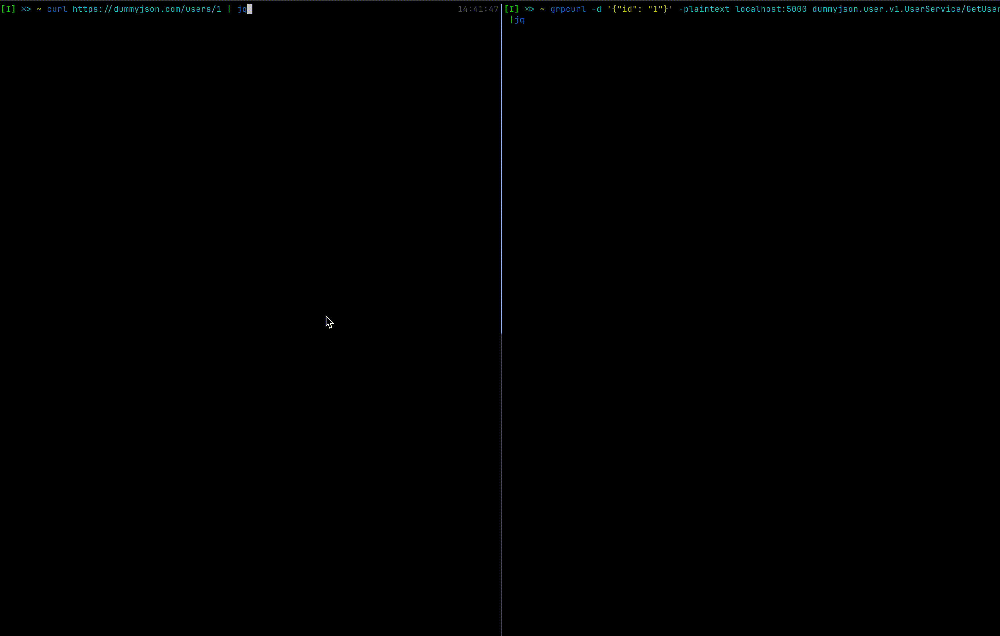

# 💥 protoc-gen-go-httpclient

Highly experimental plugin that allows to call an HTTP endpoints from native gRPC in no time.



## ✨ Features

- Fully configurable gRPC/HTTP transcoding according to [google.api.http](https://cloud.google.com/endpoints/docs/grpc/transcoding). 
- Separate `GetOne` & `ListEntities` handlers.
- Helperfunc for quick client support.
- An embedded optional logging middleware [go-kit/log](https://github.com/go-kit/kit/tree/master/log).

## ⚡️ Requirements

- Go >=v1.23.0

## 📦 Installation

```bash
go install github.com/Kuwerin/protoc-gen-go-httpclient
```

OR

```bash
git clone https://github.com/Kuwerin/protoc-gen-go-httpclient.git
cd protoc-gen-go-httpclient && make install
```

## Usage

- Describe services && proto messages using gRPC to HTTP transcoding rules.
- Specify out location files for httpclient `go-httpclient_out`
- Specify logging middleware generation if needed.
- Implement gRPC server with an HTTP client using generated `NewHTTPClient` method.

More detailed info is on the `examples`.
